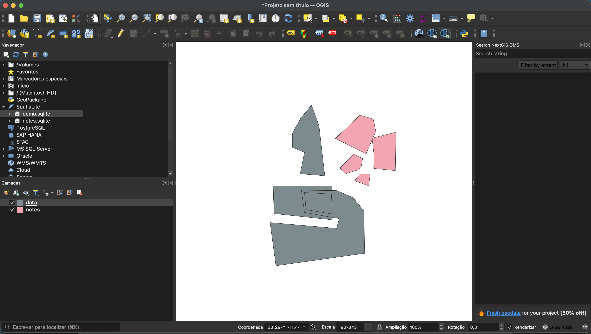

# Spatial Query Guide

This guide explains how to use spatial queries with SpatiaLite and PostGIS databases.

## Overview

The geo-service supports spatial queries for databases with geometry columns. The service automatically detects geometry columns during the prepare phase and exposes spatial query endpoints.

## GIS Editor

To create sample data provided in the data folder the QGIS editor was used.


## Supported Databases

- **SpatiaLite** - SQLite with spatial extension
- **PostGIS** - PostgreSQL with spatial extension

## Configuration

### Environment Variables

```bash
ALLOW_SPATIAL_QUERIES=true    # Enable spatial queries (default: true)
DEFAULT_SRID=4326             # Default spatial reference system (WGS84)
DEFAULT_GEOM_COLUMN=geom      # Fallback geometry column name
```

## Spatial Operations

### 1. Intersects
Find all entities whose geometry intersects with the provided geometry.

```bash
POST /geo/sample/spatial
{
  "operation": "intersects",
  "geometry": "POINT(-74.006 40.7128)"
}
```

### 2. Touches
Find all entities whose geometry touches (but doesn't overlap) the provided geometry.

```bash
POST /geo/sample/spatial
{
  "operation": "touches",
  "geometry": "LINESTRING(0 0, 10 10)"
}
```

### 3. Contains
Find all entities whose geometry contains the provided geometry.

```bash
POST /geo/sample/spatial
{
  "operation": "contains",
  "geometry": "POINT(-74.006 40.7128)"
}
```

### 4. Within
Find all entities whose geometry is within the provided geometry.

```bash
POST /geo/sample/spatial
{
  "operation": "within",
  "geometry": "POLYGON((0 0, 10 0, 10 10, 0 10, 0 0))"
}
```

### 5. Distance
Find all entities within a specified distance from the provided geometry.

```bash
POST /geo/sample/spatial
{
  "operation": "distance",
  "geometry": "POINT(-74.006 40.7128)",
  "distance": 1000
}
```

**Note:** Distance is in the units of the SRID (meters for SRID 4326).

## Request Parameters

| Parameter | Required | Type | Description |
|-----------|----------|------|-------------|
| `operation` | Yes | string | Spatial operation: `intersects`, `touches`, `contains`, `within`, `distance` |
| `geometry` | Yes | string | WKT format geometry (e.g., `POINT(x y)`) |
| `geometryColumn` | No | string | Geometry column name (auto-detected if not provided) |
| `srid` | No | number | Spatial reference system ID (default: 4326) |
| `distance` | Conditional | number | Required for `distance` operation |
| `outputFormat` | No | string | Output format: `wkt` or `geojson` (default: `wkt`) |

## WKT Geometry Formats

### Point
```
POINT(longitude latitude)
POINT(-74.006 40.7128)
```

### LineString
```
LINESTRING(x1 y1, x2 y2, x3 y3)
LINESTRING(0 0, 10 10, 20 20)
```

### Polygon
```
POLYGON((x1 y1, x2 y2, x3 y3, x4 y4, x1 y1))
POLYGON((0 0, 10 0, 10 10, 0 10, 0 0))
```

### MultiPoint
```
MULTIPOINT((x1 y1), (x2 y2))
MULTIPOINT((-74.006 40.7128), (-73.935 40.730))
```

## Output Formats

### WKT (Default)
```json
{
  "id": 1,
  "name": "New York",
  "geom": "POINT(-74.006 40.7128)"
}
```

### GeoJSON
```json
{
  "id": 1,
  "name": "New York",
  "geom": "{\"type\":\"Point\",\"coordinates\":[-74.006,40.7128]}"
}
```

## Geometry Metadata

Get information about detected geometry columns:

```bash
GET /geo/sample/spatial/metadata
```

Response:
```json
{
  "tableName": "counties",
  "geometryColumns": [
    {
      "name": "geom",
      "type": "POLYGON",
      "srid": 4326
    }
  ],
  "defaultGeomColumn": "geom"
}
```

## Examples

### Example 1: Find Counties Containing a Point

```bash
curl -X POST http://localhost:8090/geo/counties/spatial \
  -H "Content-Type: application/json" \
  -d '{
    "operation": "contains",
    "geometry": "POINT(-74.006 40.7128)",
    "outputFormat": "geojson"
  }'
```

### Example 2: Find Roads Intersecting a Polygon

```bash
curl -X POST http://localhost:8090/geo/roads/spatial \
  -H "Content-Type: application/json" \
  -d '{
    "operation": "intersects",
    "geometry": "POLYGON((0 0, 10 0, 10 10, 0 10, 0 0))",
    "geometryColumn": "line_geom"
  }'
```

### Example 3: Find Points Within 5km

```bash
curl -X POST http://localhost:8090/geo/locations/spatial \
  -H "Content-Type: application/json" \
  -d '{
    "operation": "distance",
    "geometry": "POINT(-74.006 40.7128)",
    "distance": 5000,
    "srid": 4326
  }'
```

## Setting Up SpatiaLite Database

### Create Spatial Table

```sql
-- Initialize spatial metadata
SELECT InitSpatialMetadata();

-- Create table
CREATE TABLE counties (
  id INTEGER PRIMARY KEY,
  name TEXT NOT NULL,
  population INTEGER
);

-- Add geometry column
SELECT AddGeometryColumn('counties', 'geom', 4326, 'POLYGON', 'XY');

-- Insert data
INSERT INTO counties (id, name, population, geom) VALUES (
  1,
  'New York County',
  1694251,
  GeomFromText('POLYGON((-74.02 40.70, -73.91 40.70, -73.91 40.88, -74.02 40.88, -74.02 40.70))', 4326)
);

-- Create spatial index
SELECT CreateSpatialIndex('counties', 'geom');
```

## Troubleshooting

### "No geometry column specified or detected"
- Ensure your database has geometry columns registered in `geometry_columns` table
- Specify `geometryColumn` parameter explicitly
- Check metadata endpoint: `GET /geo/sample/spatial/metadata`

### "Spatial queries are not enabled"
- Set `ALLOW_SPATIAL_QUERIES=true` in `.env`
- Restart the service

### Invalid WKT format
- Ensure coordinates are in `longitude latitude` order
- Check for proper parentheses and commas
- Validate WKT syntax

### Distance queries not working
- Ensure `distance` parameter is provided
- Check SRID units (4326 uses degrees, projected SRIDs use meters)
- Consider using a projected coordinate system for accurate distance calculations

## Performance Tips

1. **Create spatial indexes** on geometry columns
2. **Use appropriate SRID** for your data
3. **Limit result sets** with pagination
4. **Use simpler geometries** when possible
5. **Consider bounding box queries** before complex spatial operations

## Security

Spatial queries respect the same security settings as regular queries:
- `ALLOWED_CRUD` must include `R` (Read)
- `SERVICE_HEADER` authentication applies
- `ALLOW_SPATIAL_QUERIES` can disable spatial endpoints

## Additional Resources

- [SpatiaLite Documentation](https://www.gaia-gis.it/fossil/libspatialite/index)
- [PostGIS Documentation](https://postgis.net/documentation/)
- [WKT Format Specification](https://en.wikipedia.org/wiki/Well-known_text_representation_of_geometry)
